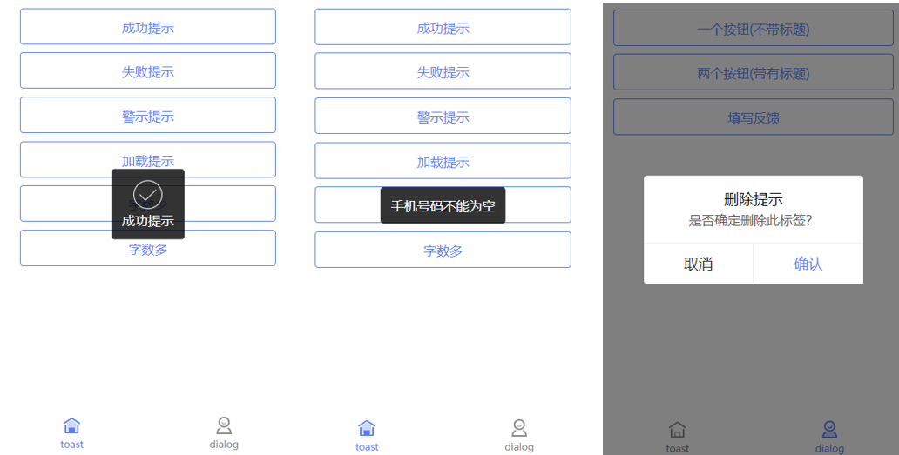
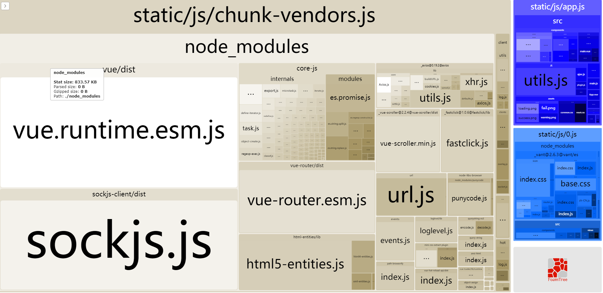

# vue-cli4-vant

## 简介

这是基于 vue-cli4 实现的移动端 H5 开发模板，其中包含项目常用的配置及组件封装，可供快速开发使用。

技术栈：vue-cli4 + webpack4 + vant + axios + less + postcss-px2rem

```js
// 安装依赖
npm install

// 本地启动
npm run dev

// 生产打包
npm run build
```

## 配置 vant

vant 是一套轻量、可靠的移动端 Vue 组件库，非常适合基于 vue 技术栈的移动端开发。在过去很长的一段时间内，本人用的移动端 UI 框架都是 vux。后来由于 vux 不支持 vue-cli3，就转用了 vant，不得不说，无论是在交互体验上，还是代码逻辑上，vant 都比 vux 好很多，而且 vant 的坑比较少。

对于第三方 UI 组件，如果是全部引入的话，比如会造成打包体积过大，加载首页白屏时间过长的问题，所以按需加载非常必要。vant 也提供了按需加载的方法。babel-plugin-import 是一款 babel 插件，它会在编译过程中将 import 的写法自动转换为按需引入的方式。

1、安装依赖

```
npm i babel-plugin-import -D
```

2、配置 .babelrc 或者 babel.config.js 文件

```js
// 在.babelrc 中添加配置
{
  "plugins": [
    ["import", {
      "libraryName": "vant",
      "libraryDirectory": "es",
      "style": true
    }]
  ]
}

// 对于使用 babel7 的用户，可以在 babel.config.js 中配置
module.exports = {
  plugins: [
    ['import', {
      libraryName: 'vant',
      libraryDirectory: 'es',
      style: true
    }, 'vant']
  ]
};
```

3、按需引入

你可以在代码中直接引入 Vant 组件，插件会自动将代码转化为方式二中的按需引入形式

```js
import Vue from 'vue'
import { Button } from 'vant'

Vue.use(Button)
```

## rem 适配

移动端适配是开发过程中不得不面对的事情。在此，我们使用 postcss 中的 px2rem-loader，将我们项目中的 px 按一定比例转化 rem，这样我们就可以对着蓝湖上的标注写 px 了。

我们将 html 字跟字体设置为 100px，很多人选择设置为 375px，但是我觉得这样换算出来的 rem 不够精确，而且我们在控制台上调试代码的时候无法很快地口算得出它本来的 px 值。如果设置 1rem=100px，这样我们看到的 0.16rem，0.3rem 就很快得算出原来是 16px，30px 了。

具体步骤如下；

1、安装依赖

```
npm install px2rem-loader --save-dev
```

2、在 vue.config.js 进行如下配置

```js
  css: {
    // css预设器配置项
    loaderOptions: {
      postcss: {
        plugins: [
          require('postcss-px2rem')({
            remUnit: 100
          })
        ]
      }
    }
  },
```

3、在 main.js 设置 html 跟字体大小

```js
function initRem() {
  let cale = window.screen.availWidth > 750 ? 2 : window.screen.availWidth / 375
  window.document.documentElement.style.fontSize = `${100 * cale}px`
}

window.addEventListener('resize', function() {
  initRem()
})
```

## axios 请求封装

1、设置请求拦截和响应拦截

```js
const PRODUCT_URL = 'https://xxxx.com'
const MOCK_URL = 'http://xxxx.com'
let http = axios.create({
  baseURL: process.env.NODE_ENV === 'production' ? PRODUCT_URL : MOCK_URL,
})
// 请求拦截器
http.interceptors.request.use(
  (config) => {
    // 设置token，Content-Type
    var token = sessionStorage.getItem('token')
    config.headers['token'] = token
    config.headers['Content-Type'] = 'application/json;charset=UTF-8'
    // 请求显示loading效果
    if (config.loading === true) {
      vm.$loading.show()
    }
    return config
  },
  (error) => {
    vm.$loading.hide()
    return Promise.reject(error)
  }
)
// 响应拦截器
http.interceptors.response.use(
  (res) => {
    vm.$loading.hide()
    // token失效，重新登录
    if (res.data.code === 401) {
      //  重新登录
    }
    return res
  },
  (error) => {
    vm.$loading.hide()
    return Promise.reject(error)
  }
)
```

2、封装 get 和 post 请求方法

```js
function get(url, data, lodaing) {
  return new Promise((resolve, reject) => {
    http
      .get(url)
      .then(
        (response) => {
          resolve(response)
        },
        (err) => {
          reject(err)
        }
      )
      .catch((error) => {
        reject(error)
      })
  })
}

function post(url, data, loading) {
  return new Promise((resolve, reject) => {
    http
      .post(url, data, { loading: loading })
      .then(
        (response) => {
          resolve(response)
        },
        (err) => {
          reject(err)
        }
      )
      .catch((error) => {
        reject(error)
      })
  })
}

export { get, post }
```

3、把 get，post 方法挂载到 vue 实例上。

```js
// main.js
import { get, post } from './js/ajax'
Vue.prototype.$http = { get, post }
```

## 工具类函数封装

1、添加方法到 vue 实例的原型链上

```js
export default {
  install (Vue, options) {
    Vue.prototype.util = {
      method1(val) {
        ...
      },
      method2 (val) {
       ...
      },
  }
}
```

2、在 main.js 通过 vue.use()注册

```js
import utils from './js/utils'
Vue.use(utils)
```

本文提供以下函数封装

- 获取 url 参数值
- 判断浏览器类型
- 判断 IOS/android
- 校验手机号码
- 检验车牌号
- 校验车架号
- 检验身份证号码
- 日期格式化
- 时间格式化
- 城市格式化
- 压缩图片
- 图片转成 base64

## vue-router 配置

平时很多人对 vue-router 的配置可配置了 path 和 component，实现了路由跳转即可。其实 vue-router 可做的事情还有很多，比如

- 路由懒加载配置
- 改变单页面应用的 title
- 登录权限校验
- 页面缓存配置

#### 路由懒加载配置

Vue 项目中实现路由按需加载（路由懒加载）的 3 中方式：

```js
// 1、Vue异步组件技术：
{
	path: '/home',
	name: 'Home',
	component: resolve => reqire(['../views/Home.vue'], resolve)
}

// 2、es6提案的import()
{
  path: '/',
  name: 'home',
  component: () => import('../views/Home.vue')
}

// 3、webpack提供的require.ensure()
{
	path: '/home',
	name: 'Home',
	component: r => require.ensure([],() =>  r(require('../views/Home.vue')), 'home')
}
```

本项目采用的是第二种方式，为了后续 webpack 打包优化。

#### 改变单页面应用的 title

由于单页面应用只有一个 html，所有页面的 title 默认是不会改变的，但是我们可以才路由配置中加入相关属性，再在路由守卫中通过 js 改变页面的 title

```js
router.beforeEach((to, from, next) => {
  document.title = to.meta.title
})
```

#### 登录权限校验

在应用中，通常会有以下的场景，比如商城：有些页面是不需要登录即可访问的，如首页，商品详情页等，都是用户在任何情况都能看到的；但是也有是需要登录后才能访问的，如个人中心，购物车等。此时就需要对页面访问进行控制了。

此外，像一些需要记录用户信息和登录状态的项目，也是需要做登录权限校验的，以防别有用心的人通过直接访问页面的 url 打开页面。

此时。路由守卫可以帮助我们做登录校验。具体如下：

1、配置路由的 meta 对象的 auth 属性

```js
const routes = [
  {
    path: '/',
    name: 'home',
    component: () => import('../views/Home.vue'),
    meta: { title: '首页', keepAlive: false, auth: false },
  },
  {
    path: '/mine',
    name: 'mine',
    component: () => import('../views/mine.vue'),
    meta: { title: '我的', keepAlive: false, auth: true },
  },
]
```

2、在路由首页进行判断。当`to.meta.auth`为`true`(需要登录)，且不存在登录信息缓存时，需要重定向去登录页面

```js
router.beforeEach((to, from, next) => {
  document.title = to.meta.title
  const userInfo = sessionStorage.getItem('userInfo') || null
  if (!userInfo && to.meta.auth) {
    next('/login')
  } else {
    next()
  }
})
```

#### 页面缓存配置

项目中，总有一些页面我们是希望加载一次就缓存下来的，此时就用到 keep-alive 了。keep-alive 是 Vue 提供的一个抽象组件，用来对组件进行缓存，从而节省性能，由于是一个抽象组件，所以在 v 页面渲染完毕后不会被渲染成一个 DOM 元素。

1、通过配置路由的 meta 对象的 keepAlive 属性值来区分页面是否需要缓存

```js
const routes = [
  {
    path: '/',
    name: 'home',
    component: () => import('../views/Home.vue'),
    meta: { title: '首页', keepAlive: false, auth: false },
  },
  {
    path: '/list',
    name: 'list',
    component: () => import('../views/list.vue'),
    meta: { title: '列表页', keepAlive: true, auth: false },
  },
]
```

2、在 app.vue 做缓存判断

```html
<div id="app">
  <router-view v-if="!$route.meta.keepAlive"></router-view>
  <keep-alive>
    <router-view v-if="$route.meta.keepAlive"></router-view>
  </keep-alive>
</div>
```

## 多环境变量配置

首先我们先来了解一下环境变量，一般情况下我们的项目会有三个环境，本地环境(development)，测试环境(test)，生产环境(production)，我们可以在项目根目录下建三个配置环境变量的文件.env.development，.env.test，.env.production

环境变量文件中只包含环境变量的“键=值”对：

```js
NODE_ENV = 'production'
VUE_APP_ENV = 'production' // 只有VUE_APP开头的环境变量可以在项目代码中直接使用
```

除了自定义的 VUE*APP*\*变量之外，还有两个可用的变量：

- NODE_ENV : "development"、"production" 或 "test"中的一个。具体的值取决于应用运行的模式。
- BASE_URL : 和 vue.config.js 中的 publicPath 选项相符，即你的应用会部署到的基础路径。

下面开始配置我们的环境变量

1、在项目根目录中新建.env.\*

- .env.development 本地开发环境配置

```
NODE_ENV='development'
VUE_APP_ENV = 'development'
```

- env.staging 测试环境配置

```
NODE_ENV='production'
VUE_APP_ENV = 'staging'
```

- env.production 正式环境配置

```
NODE_ENV='production'
VUE_APP_ENV = 'production'
```

为了在不同环境配置更多的变量，我们在 src 文件下新建一个 config/index

```js
// 根据环境引入不同配置 process.env.NODE_ENV
const config = require('./env.' + process.env.VUE_APP_ENV)
module.exports = config
```

在同级目录下新建 env.development.js，env.test.js，env.production.js，在里面配置需要的变量。  
以 env.development.js 为例

```js
module.exports = {
  baseUrl: 'http://localhost:8089', // 项目地址
  baseApi: 'https://www.mock.com/api', // 本地api请求地址
}
```

2、配置打包命令

package.json 里的 scripts 不同环境的打包命令

- 通过 npm run serve 启动本地
- 通过 npm run test 打包测试
- 通过 npm run build 打包正式

```js
"scripts": {
  "dev": "vue-cli-service serve",
  "build": "vue-cli-service build",
  "test": "vue-cli-service build --mode test",
}
```

## vue.config.js 配置

vue-cli3 开始，新建的脚手架都需要我们在 vue.config.js 配置我们项目的东西。主要包括

- 打包后文件输出位置
- 关闭生产环境 souecemap
- 配置 rem 转化 px
- 配置 alias 别名
- 去除生产环境 console
- 跨域代理设置

此外，还有很多属于优化打包的配置，后面会一一道来。

```js
module.exports = {
  // 部署应用包时的基本URL，默认为'/'
  publicPath: './',

  // 将构建好的文件输出到哪里，本司要求
  outputDir: 'dist/static',

  // 放置生成的静态资源(js、css、img、fonts)的目录。
  assetsDir: 'static',

  // 指定生成的 index.html 的输出路径
  indexPath: 'index.html',

  // 是否使用包含运行时编译器的 Vue 构建版本。
  runtimeCompiler: false,

  // 默认情况下 babel-loader 会忽略所有 node_modules 中的文件。如果你想要通过 Babel 显式转译一个依赖，可以在这个选项中列出来。
  transpileDependencies: [],

  // 如果你不需要生产环境的 source map，可以将其设置为 false 以加速生产环境构建。
  productionSourceMap: false,

  // 配置css
  css: {
    // 是否使用css分离插件 ExtractTextPlugin
    extract: true,
    sourceMap: true,
    // css预设器配置项
    loaderOptions: {
      postcss: {
        // options here will be passed to postcss-loader
        plugins: [
          require('postcss-px2rem')({
            remUnit: 100,
          }),
        ],
      },
    },
    // 启用 CSS modules for all css / pre-processor files.
    modules: false,
  },

  // 是一个函数，允许对内部的 webpack 配置进行更细粒度的修改。
  chainWebpack: (config) => {
    // 配置别名
    config.resolve.alias
      .set('@', resolve('src'))
      .set('assets', resolve('src/assets'))
      .set('components', resolve('src/components'))
      .set('views', resolve('src/views'))

    config.optimization.minimizer('terser').tap((args) => {
      // 去除生产环境console
      args[0].terserOptions.compress.drop_console = true
      return args
    })
  },

  // 是否为 Babel 或 TypeScript 使用 thread-loader。该选项在系统的 CPU 有多于一个内核时自动启用，仅作用于生产构建。
  parallel: require('os').cpus().length > 1,

  devServer: {
    host: '0.0.0.0',
    port: 8088, // 端口号
    https: false, // https:{type:Boolean}
    open: false, // 配置自动启动浏览器  open: 'Google Chrome'-默认启动谷歌

    // 配置多个代理
    proxy: {
      '/api': {
        target: 'https://www.mock.com',
        ws: true, // 代理的WebSockets
        changeOrigin: true, // 允许websockets跨域
        pathRewrite: {
          '^/api': '',
        },
      },
    },
  },
}
```

## 基础组件封装

在开发项目过程中，通常会用到很多功能和设计相类似的组件，toast 和 dialog 组件基本是每一个移动端项目都会用到的。为了更好匹配自己公司的 UI 设计风格，我们没有直接用 vant 的 toast 和 dialog 组件，而是自己封装了类似的组件，可供直接调用，如：

```js
this.$toast({ msg: '手机号码不能为空' })

this.$toast({
  msg: '成功提示',
  type: 'success',
})

this.$dialog({
  title: '删除提示',
  text: '是否确定删除此标签？',
  showCancelBtn: true,
  confirmText: '确认',
  confirm(content) {
    alert('删除成功')
  },
})
```

效果图如下


#### toast 传入参数

**Props**

| name | type   | default | description                                                            |
| ---- | ------ | ------- | ---------------------------------------------------------------------- |
| msg  | String | ''      | 弹窗提示语                                                             |
| type | String | ''      | 弹窗类型：success(成功提示),fail(失败提示),warning(警告),loading(加载) |

#### dialog 传入参数

**Props**

| name        | type   | default | description               |
| ----------- | ------ | ------- | ------------------------- |
| title       | String | ''      | 标题                      |
| text        | String | ''      | 文本内容                  |
| type        | String | ''      | 默认纯文本，input(输入框) |
| maxlength   | Number | 20      | 输入的最多字数            |
| confirmText | String | 确定    | 右边按钮                  |
| cancelText  | String | 取消    | 左边按钮                  |

**Events**

| name    | params | description  |
| ------- | ------ | ------------ |
| confirm | null   | 选择后的回调 |
| cancel  | ull    | 取消后的回调 |

## webpack 可视化分析

从这里开始，我们开始进行 webpack 优化打包。首先我们来分析一下 webpack 打包性能瓶颈，找出问题所在，然后才能对症下药。此时就用到 webpack-bundle-analyzer 了。
1、安装依赖

```js
npm install webpack-bundle-analyzer -D
```

2、在 vue.config.js 配置

```js
const { BundleAnalyzerPlugin } = require('webpack-bundle-analyzer')
configureWebpack: (config) => {
  if (process.env.NODE_ENV === 'production') {
    config.plugins.push(new BundleAnalyzerPlugin())
  }
}
```

打包后，我们可以看到这样一份依赖图


从以上的界面中，我们可以得到以下信息：

- 打包出的文件中都包含了什么，以及模块之间的依赖关系
- 每个文件的大小在总体中的占比，找出较大的文件，思考是否有替换方案，是否使用了它包含了不必要的依赖？
- 是否有重复的依赖项，对此可以如何优化？
- 每个文件的压缩后的大小。

## CDN 资源优化

CDN 的全称是 `Content Delivery Network`，即内容分发网络。CDN 是构建在网络之上的内容分发网络，依靠部署在各地的边缘服务器，通过中心平台的负载均衡、内容分发、调度等功能模块，使用户就近获取所需内容，降低网络拥塞，提高用户访问响应速度和命中率。CDN 的关键技术主要有内容存储和分发技术。

随着项目越做越大，依赖的第三方 npm 包越来越多，构建之后的文件也会越来越大。再加上又是单页应用，这就会导致在网速较慢或者服务器带宽有限的情况出现长时间的白屏。此时我们可以使用 CDN 的方法，优化网络加载速度。

1、将 `vue、vue-router、vuex、axios` 这些 vue 全家桶的资源，全部改为通过 CDN 链接获取，在 `index.html` 里插入 相应链接。

```html
<body>
  <div id="app"></div>
  <script src="https://cdn.bootcss.com/vue/2.6.10/vue.min.js"></script>
  <script src="https://cdn.bootcss.com/axios/0.19.0-beta.1/axios.min.js"></script>
  <script src="https://cdn.bootcss.com/vuex/3.1.0/vuex.min.js"></script>
  <script src="https://cdn.bootcss.com/vue-router/3.0.2/vue-router.min.js"></script>
  <script src="https://cdn.bootcss.com/element-ui/2.6.1/index.js"></script>
</body>
```

2、在 `vue.config.js` 配置 externals 属性

```javascript
module.exports = {
 ···
    externals: {
      'vue': 'Vue',
      'vuex': 'Vuex',
      'vue-router': 'VueRouter',
      'axios':'axios'
    }
  }
```

3、卸载相关依赖的 npm 包

```
npm uninstall  vue vue-router vuex axios
```

此时启动项目运行就可以了。我们在控制台就能发现项目加载了以上四个 CDN 资源。

不过现在有不少声音说，vue 全家桶加载 CDN 资源其实作用并不大，而且公共的 CDN 资源也没有 npm 包那么稳定，这个就见仁见智了。所以我在源码时新建的分支做这个优化。当项目较小的就不考虑 CDN 优化了。

当然，当引入其他较大第三方资源，比如 echarts，AMAP(高德地图)，采用 CDN 资源还是很有必要的。

## gZip 加速优化

所有现代浏览器都支持 gzip 压缩，启用 gzip 压缩可大幅缩减传输资源大小，从而缩短资源下载时间，减少首次白屏时间，提升用户体验。

gzip 对基于文本格式文件的压缩效果最好（如：CSS、JavaScript 和 HTML），在压缩较大文件时往往可实现高达 70-90% 的压缩率，对已经压缩过的资源（如：图片）进行 gzip 压缩处理，效果很不好。

```js
const CompressionPlugin = require('compression-webpack-plugin')
configureWebpack: (config) => {
  if (process.env.NODE_ENV === 'production') {
    config.plugins.push(
      new CompressionPlugin({
        // gzip压缩配置
        test: /\.js$|\.html$|\.css/, // 匹配文件名
        threshold: 10240, // 对超过10kb的数据进行压缩
        deleteOriginalAssets: false, // 是否删除原文件
      })
    )
  }
}
```

## 首页添加骨架屏

随着 SPA 在前端界的逐渐流行，单页面应用不可避免地给首页加载带来压力，此时良好的首页用户体验至关重要。很多 APP 采用了“骨架屏”的方式去展示未加载内容，给予了用户焕然一新的体验。

所谓的骨架屏，就是在页面内容未加载完成的时候，先使用一些图形进行占位，待内容加载完成之后再把它替换掉。在这个过程中用户会感知到内容正在逐渐加载并即将呈现，降低了“白屏”的不良体验。

本文采用vue-skeleton-webpack-plugin插件为单页面应用注入骨架屏。  

1、在src的common文件夹下面创建了Skeleton1.vue，Skeleton2.vue，具体的结构和样式自行设计，此处省略一万字。。。。

2、在同级目录下新建entry-skeleton.js
```js
import Vue from 'vue'
import Skeleton1 from './Skeleton1'
import Skeleton2 from './Skeleton2'

export default new Vue({
  components: {
    Skeleton1,
    Skeleton2
  },
  template: `
    <div>
      <skeleton1 id="skeleton1" style="display:none"/>
      <skeleton2 id="skeleton2" style="display:none"/>
    </div>
  `
})
```
在vue.config.js下配置插件

```js
const SkeletonWebpackPlugin = require('vue-skeleton-webpack-plugin')
configureWebpack: (config) => {
  config.plugins.push(
    new SkeletonWebpackPlugin({
      webpackConfig: {
        entry: {
          app: path.join(__dirname, './src/common/entry-skeleton.js'),
        },
      },
      minimize: true,
      quiet: true,
      router: {
        mode: 'hash',
        routes: [
          { path: '/', skeletonId: 'skeleton1' },
          { path: '/about', skeletonId: 'skeleton2' },
        ],
      },
    })
  )
}
```
此时重新加载页面就可以看到我们的骨架屏了。**注意：一定要配置样式分离extract: true**
